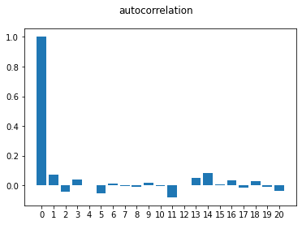
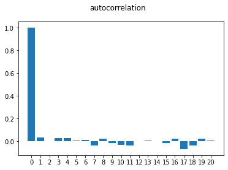
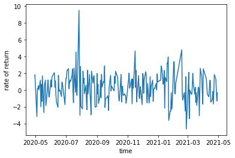

研究金融時間序列報酬的自相關性，並用bar圖呈現
先導入常用套件，我用了object方式寫了一些相關的功能，但其實一般function就可
主要是為了未來可以重複引用


```python
import pandas as pd
import numpy as np
import yfinance as yf
import matplotlib.pyplot as plt
```


```python
class finance:
    
    def __init__(self, time_series):
        
        self.time_series = np.array(time_series)
        self.avg = self.time_series.mean()
        self.var = self.time_series.var(ddof = 1)
        self.length = len(time_series)
    
    def describle(self):
        return print(f'Data平均: {self.avg}',f'Data變異數: {self.var}')
    
    def cov(self, k):
        #k為lag的期數
        #range(k - 1, self.length) >> 假設k=1 data有10期 則這給了range(1,2,...10)
        #再用reversed使數列反過來為(10,9,8,....1)
        #之後用list comperhensive 將(time t與time t-k的data)與平均數的差相乘並暫存在list中，後續在加總並除上n-k-1
        cov_list = [ (self.time_series[t] - self.avg) * (self.time_series[t - k] - self.avg) for t in reversed(range(k, self.length)) ]
        cov =  sum(cov_list)/ (self.length - k - 1)
        #與np.cov(rt[:-1],rt[1::], ddof = 1)不同在於，自製的cov為weakly stationay的假設，其平均數為常數，用np.cov的話，rt[:-1]與rt[1::]其平均數會有些微差異
        return cov
    
    def autocorrl(self, k):
        
        return self.cov(k) / self.var
```

再來我們使用yahoofianace的資料
這次研究的個股為台積電2330，至於資料時間長度可按喜好決定
這次示範就以3年台積電的股價做示範
先算出其對數報酬率，並存放在rt的list當中


```python
raw_data = yf.download(tickers = '2330.TW', period = '1y', interval = '1d' )
rt = [100 * (np.log(raw_data['Close'][t]) - np.log(raw_data['Close'][t - 1])) for t in range(1,len(raw_data['Close'])) ]
```

    [*********************100%***********************]  1 of 1 completed


```python
raw_data.head()
```


<div>
<style scoped>
    .dataframe tbody tr th:only-of-type {
        vertical-align: middle;
    }

    .dataframe tbody tr th {
        vertical-align: top;
    }

    .dataframe thead th {
        text-align: right;
    }
</style>
<table border="1" class="dataframe">
  <thead>
    <tr style="text-align: right;">
      <th></th>
      <th>Open</th>
      <th>High</th>
      <th>Low</th>
      <th>Close</th>
      <th>Adj Close</th>
      <th>Volume</th>
    </tr>
    <tr>
      <th>Date</th>
      <th></th>
      <th></th>
      <th></th>
      <th></th>
      <th></th>
      <th></th>
    </tr>
  </thead>
  <tbody>
    <tr>
      <th>2020-04-29</th>
      <td>299.0</td>
      <td>301.5</td>
      <td>298.0</td>
      <td>299.0</td>
      <td>292.370087</td>
      <td>44059301</td>
    </tr>
    <tr>
      <th>2020-04-30</th>
      <td>302.0</td>
      <td>305.0</td>
      <td>301.5</td>
      <td>304.5</td>
      <td>297.748169</td>
      <td>55126085</td>
    </tr>
    <tr>
      <th>2020-05-04</th>
      <td>294.5</td>
      <td>296.5</td>
      <td>294.0</td>
      <td>295.0</td>
      <td>288.458801</td>
      <td>71581861</td>
    </tr>
    <tr>
      <th>2020-05-05</th>
      <td>296.5</td>
      <td>298.0</td>
      <td>295.0</td>
      <td>295.5</td>
      <td>288.947723</td>
      <td>23547405</td>
    </tr>
    <tr>
      <th>2020-05-06</th>
      <td>294.5</td>
      <td>296.0</td>
      <td>292.5</td>
      <td>296.0</td>
      <td>289.436615</td>
      <td>34240479</td>
    </tr>
  </tbody>
</table>
</div>


```python
raw_data.tail()
```


<div>
<style scoped>
    .dataframe tbody tr th:only-of-type {
        vertical-align: middle;
    }

    .dataframe tbody tr th {
        vertical-align: top;
    }

    .dataframe thead th {
        text-align: right;
    }
</style>
<table border="1" class="dataframe">
  <thead>
    <tr style="text-align: right;">
      <th></th>
      <th>Open</th>
      <th>High</th>
      <th>Low</th>
      <th>Close</th>
      <th>Adj Close</th>
      <th>Volume</th>
    </tr>
    <tr>
      <th>Date</th>
      <th></th>
      <th></th>
      <th></th>
      <th></th>
      <th></th>
      <th></th>
    </tr>
  </thead>
  <tbody>
    <tr>
      <th>2021-04-23</th>
      <td>592.0</td>
      <td>602.0</td>
      <td>590.0</td>
      <td>602.0</td>
      <td>602.0</td>
      <td>27754511</td>
    </tr>
    <tr>
      <th>2021-04-26</th>
      <td>605.0</td>
      <td>610.0</td>
      <td>603.0</td>
      <td>610.0</td>
      <td>610.0</td>
      <td>30887664</td>
    </tr>
    <tr>
      <th>2021-04-27</th>
      <td>608.0</td>
      <td>611.0</td>
      <td>605.0</td>
      <td>610.0</td>
      <td>610.0</td>
      <td>26317481</td>
    </tr>
    <tr>
      <th>2021-04-28</th>
      <td>606.0</td>
      <td>608.0</td>
      <td>601.0</td>
      <td>602.0</td>
      <td>602.0</td>
      <td>24024054</td>
    </tr>
    <tr>
      <th>2021-04-29</th>
      <td>609.0</td>
      <td>609.0</td>
      <td>600.0</td>
      <td>600.0</td>
      <td>600.0</td>
      <td>31828333</td>
    </tr>
  </tbody>
</table>
</div>


```python
rt[-5::] #台積電近五天的對數報酬率
```


    [1.8441427902722296,
     1.3201511858536463,
     0.0,
     -1.3201511858536463,
     -0.33277900926744763]


再來我們就可以使用寫好的object來計算lag不同其數台積電對數報酬率的自相關係數了，並用matplotlab繪製bar圖


```python
#研究20期
data = finance(rt)
bar_data = [data.autocorrl(k) for k in range(21)]

```


```python
fig = plt.figure()
fig.suptitle('autocorrelation')
ax1 = fig.add_subplot()
ax1.set_xticks(range(21))
ax1.bar(range(21),np.array(bar_data))
```


    <BarContainer object of 21 artists>





我們用常態分配隨機創造出來的white noise來比較看看


```python
random_data = finance(np.random.normal(0, 1, 1000))
ran_bar_data = [random_data.autocorrl(k) for k in range(21)]

fig = plt.figure()
fig.suptitle('autocorrelation')
ax1 = fig.add_subplot()
ax1.set_xticks(range(21))
ax1.bar(range(21),np.array(ran_bar_data))
```


    <BarContainer object of 21 artists>





可見相較於白噪音完全隨機的自相關係數
台積電的股價報酬明顯有自我相關
然而台積電的股價報酬嚴格來說並不符合時間序列中的平穩假設
尤其是變異數為常數的假設
我們可以藉由plot台積電的報酬率出來


```python
fig = plt.figure()
ax1 = fig.add_subplot()
ax1.set_ylabel("rate of return")
ax1.set_xlabel("time")
ax1.plot(raw_data.index[1::], rt)
```


    [<matplotlib.lines.Line2D at 0x7fa2d4dcd190>]





明顯在2020/7-2020/9間報酬率的波動大
但在2020/11-2021/1月間報酬率的波動小
之後的更新也會注重在檢定時間序列的平穩性與一些模型的回測上
感謝收看！


```python

```
